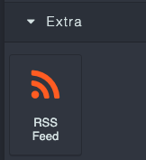
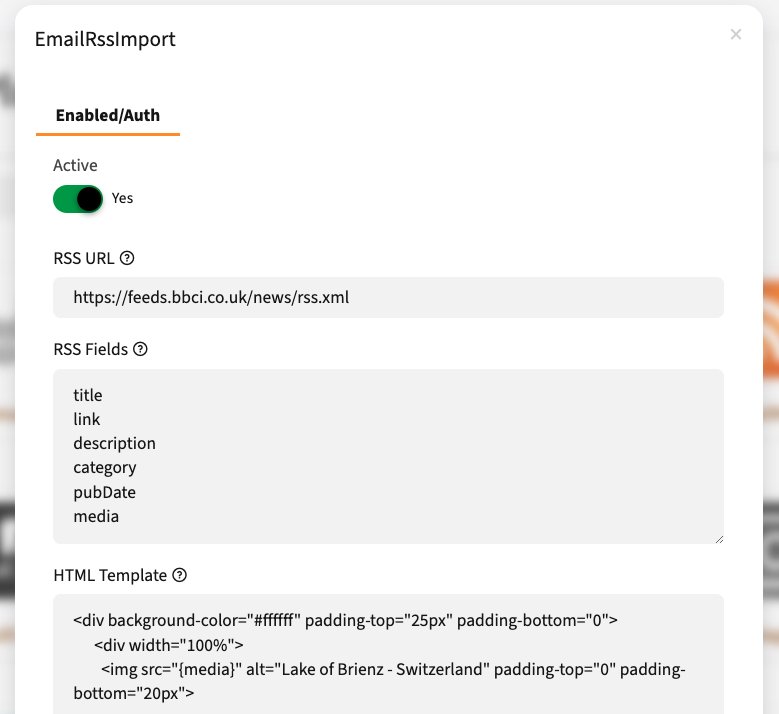
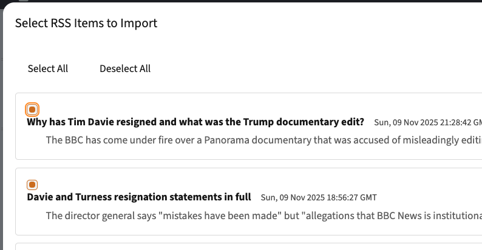

# Mautic Email RSS Import Bundle

A powerful Mautic plugin that seamlessly integrates RSS feed content into your emails using the GrapesJS email builder. Import news articles, blog posts, or any RSS feed content directly into your email campaigns with a single click.

## Features

- 🎯 **GrapesJS Integration** - Native block in the GrapesJS builder for easy content import
- 📰 **Multiple RSS Feed Support** - Configure and import from multiple RSS feeds
- 🤖 **Daily Automation** - Automatically fetch RSS feeds daily via cron
- 💾 **Caching** - Store RSS items in database for faster access and offline availability
- 🎨 **Customizable Templates** - Define your own MJML templates with token support
- ✅ **Multi-Selection** - Select multiple RSS items at once
- 🔧 **Flexible Configuration** - Configure RSS feeds, fields, and templates per installation
- 🚀 **No Core Modifications** - Clean extension using Mautic's plugin system

## Screenshots

### 1. GrapesJS Block
Find the RSS Feed block in your GrapesJS email builder's block panel:



### 2. Plugin Configuration
Configure your RSS feed settings in Mautic Settings → Plugins:



### 3. Content Selection
Select the RSS items you want to import into your email:



## Installation

### Option 1: Composer (Recommended)

1. Add the plugin to your Mautic installation:
   ```bash
   composer require mautic/email-rss-import-bundle
   ```

2. Clear the Mautic cache:
   ```bash
   php bin/console cache:clear
   ```

3. Navigate to Mautic Settings → Plugins
4. Click "Install/Upgrade Plugins"
5. Find "Email RSS Import" and click to configure it

### Option 2: Manual Installation

1. Clone or download this repository into your Mautic plugins directory:
   ```bash
   cd /path/to/mautic/plugins
   git clone <repository-url> MauticEmailRssImportBundle
   ```

2. Clear the Mautic cache:
   ```bash
   php bin/console cache:clear
   ```

3. Navigate to Mautic Settings → Plugins
4. Click "Install/Upgrade Plugins"
5. Find "Email RSS Import" and click to configure it

### Option 3: Private Repository

If you're hosting this plugin in a private repository, add it to your `composer.json`:

```json
{
    "repositories": [
        {
            "type": "vcs",
            "url": "https://github.com/your-username/mautic-email-rss-import-bundle.git"
        }
    ],
    "require": {
        "mautic/email-rss-import-bundle": "^1.0"
    }
}
```

Then run:
```bash
composer update mautic/email-rss-import-bundle
php bin/console cache:clear
```

## Configuration

Navigate to **Settings → Plugins → Email RSS Import** to configure:

### RSS Feeds (Multiple Feeds Support)
Define multiple RSS feeds with names, one per line in the format: `Feed Name|URL`

**Format**: `Feed Name|https://example.com/rss.xml`

**Example**:
```
BBC News|https://feeds.bbci.co.uk/news/rss.xml
TechCrunch|https://techcrunch.com/feed/
CNN Top Stories|http://rss.cnn.com/rss/cnn_topstories.rss
```

When using the GrapesJS block, you'll be able to select which feed to import from.

### RSS Fields
Define which fields to extract from the RSS feed (one per line).

**Available fields**:
- `title` - The article title
- `link` - The article URL
- `description` - Article description/summary
- `category` - Article category/categories
- `pubDate` - Publication date
- `media` - Featured image/media URL

### HTML Template
Define the MJML template for each RSS item. Use tokens to insert RSS field values.

**Available tokens**: `{title}`, `{link}`, `{description}`, `{category}`, `{pubDate}`, `{media}`

**Example template**:
```xml
<mj-section background-color="#ffffff" padding-top="25px" padding-bottom="0">
  <mj-column width="100%">
    <mj-image src="{media}" alt="{title}" padding-top="0" padding-bottom="20px"></mj-image>
    <mj-text color="#000000" font-family="Ubuntu, Helvetica, Arial, sans-serif" font-size="20px" line-height="1.5" font-weight="500" padding-bottom="0px">
      <p>{title}</p>
    </mj-text>
    <mj-text color="#000000" font-family="Ubuntu, Helvetica, Arial, sans-serif" font-size="16px" line-height="1.5" font-weight="300" align="justify">
      <p>{description}</p>
    </mj-text>
    <mj-button background-color="#486AE2" color="#FFFFFF" href="{link}" font-family="Ubuntu, Helvetica, Arial, sans-serif" padding-top="20px" padding-bottom="40px">READ MORE</mj-button>
    <mj-text color="#666666" font-family="Ubuntu, Helvetica, Arial, sans-serif" font-size="12px">
      <p>{category} - {pubDate}</p>
    </mj-text>
  </mj-column>
</mj-section>
```

## Usage

### In GrapesJS Email Builder

1. **Open the Email Builder**
   - Create a new email or edit an existing one
   - Click "Builder" to launch GrapesJS

2. **Find the RSS Feed Block**
   - Look in the left sidebar blocks panel
   - Scroll to the "Extra" category
   - Click on the "RSS Feed" block (orange RSS icon)

3. **Select Content**
   - A modal will appear showing all available RSS items
   - Use checkboxes to select the items you want to import
   - Use "Select All" or "Deselect All" for bulk selection
   - Click "Insert Selected Items"

4. **Save Your Email**
   - The selected RSS items will be inserted into your email
   - Each item will be formatted according to your template
   - Items are inserted in chronological order from the feed

## Daily Automation

The plugin can automatically fetch RSS feeds on a daily basis and store them in the database for faster access and offline availability.

### Automatic Fetching (via Mautic Cron)

The plugin automatically hooks into Mautic's maintenance cron job. When Mautic's cron runs, it will:
- Fetch all configured RSS feeds
- Store new items in the database
- Skip duplicate items (based on GUID/link)
- Clean up items older than 30 days

**Setup Mautic Cron** (if not already configured):
```bash
# Add to your crontab
*/5 * * * * php /path/to/mautic/bin/console mautic:segments:update
*/5 * * * * php /path/to/mautic/bin/console mautic:campaigns:trigger
*/5 * * * * php /path/to/mautic/bin/console mautic:campaigns:rebuild
0 2 * * * php /path/to/mautic/bin/console mautic:maintenance:cleanup --days-old=365
```

The RSS fetching will run during the `mautic:maintenance:cleanup` command.

### Manual Fetching (via CLI)

You can also manually fetch RSS feeds using the command line:

```bash
# Fetch all configured RSS feeds
php bin/console mautic:rss:fetch

# Fetch and clean up items older than 60 days
php bin/console mautic:rss:fetch --cleanup=60
```

**Command Options:**
- `--cleanup=X` - Clean up items older than X days (default: 30)

**Command Output Example:**
```
RSS Feed Fetcher
================

Configured Feeds
----------------
 * BBC News: https://feeds.bbci.co.uk/news/rss.xml
 * TechCrunch: https://techcrunch.com/feed/

Fetching Feeds
--------------
Fetching 'BBC News'... ✓ 15 added, 5 skipped
Fetching 'TechCrunch'... ✓ 12 added, 8 skipped

Summary
-------
[OK] Total items added: 27

Total items skipped: 13

Cleanup
-------
Removing items older than 30 days... ✓ 145 items deleted
```

### Using Cached Items

When RSS items are cached in the database, you can use them in the GrapesJS builder. The plugin will automatically use the latest cached items, which provides:
- **Faster loading** - No need to fetch from external RSS feeds
- **Offline availability** - Works even if the RSS feed is temporarily unavailable
- **Consistent content** - All users see the same cached content

## How It Works

1. **Extension System**: The plugin registers itself with GrapesJS using Mautic's `window.MauticGrapesJsPlugins` extension system
2. **Block Registration**: A custom block is added to the GrapesJS BlockManager
3. **RSS Fetching**: When clicked, the plugin fetches RSS content from your configured feed via AJAX
4. **Token Replacement**: Selected items are processed through the template with tokens replaced by actual values
5. **Content Insertion**: The rendered MJML is inserted into the email canvas

## Technical Details

### Architecture

- **Backend Controller**: `RssController.php` - Fetches and parses RSS feeds (with cache support)
- **Integration Class**: `EmailRssImportIntegration.php` - Handles plugin configuration
- **Frontend Extension**: `grapesjs-rss-import.js` - GrapesJS block and modal functionality
- **Event Subscribers**:
  - `AssetSubscriber.php` - Injects JavaScript assets
  - `CronSubscriber.php` - Handles daily automatic RSS fetching
- **Service Layer**: `RssService.php` - Business logic for fetching and storing RSS items
- **Entity Layer**:
  - `RssItem.php` - Database entity for cached RSS items
  - `RssItemRepository.php` - Repository for querying RSS items
- **Command**: `FetchRssCommand.php` - CLI command for manual RSS fetching

### Supported RSS Formats

- RSS 2.0
- Media RSS (for featured images)
- Multiple categories per item

### Requirements

- Mautic 4.x or higher
- PHP 7.4 or higher
- GrapesJS Builder Plugin enabled
- SimpleXML PHP extension

## Troubleshooting

### RSS Feed Block Not Showing

1. Ensure the plugin is **Published** in Settings → Plugins
2. Ensure the "Active" setting is set to **Yes** in plugin configuration
3. Clear Mautic cache: `php bin/console cache:clear`
4. Check browser console for JavaScript errors

### MJML Errors When Saving

- Ensure your template only contains valid MJML components
- Do not wrap the template in `<mjml>` or `<mj-body>` tags (these are added automatically)
- Ensure all text content is wrapped in `<mj-text>` components
- Validate your MJML at https://mjml.io/try-it-live

### RSS Feed Not Loading

- Check that the RSS URL is accessible from your server
- Verify the RSS URL returns valid XML
- Check server logs for any PHP errors
- Ensure your server can make outbound HTTP requests

## Development

### File Structure

```
MauticEmailRssImportBundle/
├── Assets/
│   ├── css/
│   │   └── rss-import.css
│   ├── img/
│   │   └── rss-icon.png
│   └── js/
│       └── grapesjs-rss-import.js
├── Command/
│   └── FetchRssCommand.php
├── Config/
│   └── config.php
├── Controller/
│   └── RssController.php
├── Entity/
│   ├── RssItem.php
│   └── RssItemRepository.php
├── EventListener/
│   ├── AssetSubscriber.php
│   └── CronSubscriber.php
├── Integration/
│   └── EmailRssImportIntegration.php
├── Resources/
│   └── views/
├── Service/
│   └── RssService.php
├── Translations/
│   └── en_US/
│       └── messages.ini
├── MauticEmailRssImportBundle.php
├── composer.json
└── README.md
```

### Extending the Plugin

To add custom RSS field parsing, modify `RssController.php`:

```php
// Handle custom namespace
$namespaces = $item->getNamespaces(true);
if (isset($namespaces['custom'])) {
    $custom = $item->children($namespaces['custom']);
    $value = (string) $custom->customField;
}
```

## Author

Frederik Wouters

## License

This plugin is provided as-is for use with Mautic installations.

## Support

For issues, questions, or contributions, please open an issue in the repository.

## Publishing to Packagist

To make this plugin available via Composer for everyone:

1. **Push to GitHub** (or GitLab/Bitbucket):
   ```bash
   git init
   git add .
   git commit -m "Initial release v1.0.0"
   git tag v1.0.0
   git remote add origin https://github.com/your-username/mautic-email-rss-import-bundle.git
   git push -u origin main
   git push --tags
   ```

2. **Submit to Packagist**:
   - Go to https://packagist.org
   - Sign in with your GitHub account
   - Click "Submit"
   - Enter your repository URL: `https://github.com/your-username/mautic-email-rss-import-bundle`
   - Packagist will automatically track new releases via your Git tags

3. **Auto-Update Hook** (Optional):
   - In your GitHub repository settings, add Packagist webhook for automatic updates
   - Settings → Webhooks → Add webhook
   - Payload URL: `https://packagist.org/api/github?username=YOUR_USERNAME`

## Version Tagging

When releasing new versions:
```bash
# Update composer.json version if needed
git add .
git commit -m "Release v1.1.0"
git tag v1.1.0
git push && git push --tags
```

Packagist will automatically detect the new tag and update the package.

## Changelog

### Version 2.0.0
- **Multiple RSS Feeds Support** - Configure and use multiple RSS feeds with names
- **Daily Automation** - Automatic RSS fetching via cron integration
- **Database Caching** - Store RSS items in database for faster access
- **CLI Command** - Manual RSS fetching via `mautic:rss:fetch` command
- **Feed Selector** - Choose which feed to import in GrapesJS
- **Automatic Cleanup** - Remove old RSS items automatically
- **Enhanced Architecture** - Added Service layer, Entity layer, and Repository pattern
- **Backward Compatibility** - Maintains support for single RSS URL configuration

### Version 1.0.0
- Initial release
- GrapesJS block integration
- RSS feed parsing with configurable fields
- MJML template support with token replacement
- Multi-item selection
- Configuration interface
- Drag-and-drop block functionality
- Composer support
